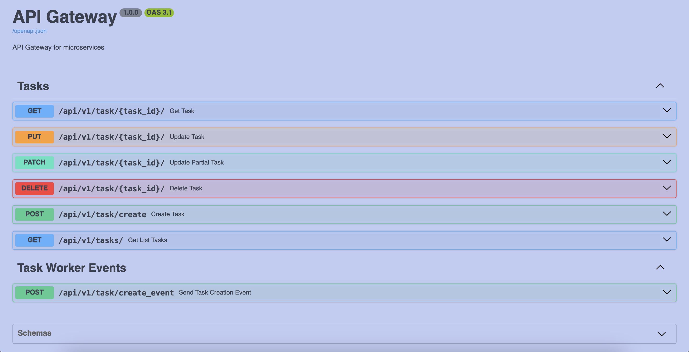

# FastAPI Microservices

Микро-сервисы на FastAPI с использованием PostgreSQL, SQLAlchemy 2.0 и Docker.

## 🚀 Технологии

- **FastAPI** - веб-фреймворк для создания API
- **Uvicorn** - ASGI сервер для FastAPI
- **SQLAlchemy** - ORM для работы с базой данных
- **PostgreSQL** - реляционная база данных
- **Alembic** - управление миграциями
- **Docker** и **Docker Compose** - контейнеризация
- **Make** - упрощение команд для запуска проекта
- **Poetry** - управление зависимостями
- **Pydantic** - валидация данных
- **Loki** - система логирования
- **Grafana** - система мониторинга
- **Promtail** - инструмент для сбора логов
- **Kafka** - система обмена сообщениями
- **Kafka-UI** - визуальный интерфейс для работы с Kafka
- **Locust** - инструмент для нагрузочного тестирования

## 🚀 Запуск проекта

### Требования

- Docker и Docker Compose
- Python 3.13+
- Poetry
- Make

### Установка

1. Клонируйте репозиторий:

   ```bash
   git clone https://github.com/powermacintosh/microservices-example.git
   cd microservices-example
   ```

2. Создайте файл `.env` на основе `.env.test`:

3. Запустите приложение с помощью Makefile:

```bash
make build
```

## 🧪 Запуск тестов

```bash
make test
```

## 📚 Документация API

После запуска документация API будет доступна по адресу:

- Swagger UI: http://localhost:5000/docs/
  

## 🔧 Настройка окружения

Создайте файл `.env` в корне проекта и в каждом сервисе
`gateway/`, `tasks/`.
Аналогично файлу `.env.test`.

```env
MODE = DEVELOPMENT
```

## 📊 Логирование в Grafana

Логи приложения отправляются в Loki и доступны через Grafana.
**Grafana**: `http://localhost:3010`

`Логин` - admin
`Пароль` - admin (при первом входе)

### Подключение Loki к Grafana

**Loki-connection-url**: `http://loki:3100`

## 🎯 Подключение к Kafka-UI

**Kafka-UI-connection-url**: `http://localhost:8080`

## 🧪 Запуск нагрузочного тестирования Locust

**Locust-connection-url**: `http://localhost:8089`

## 📄 Лицензия

Этот проект распространяется под лицензией MIT.
