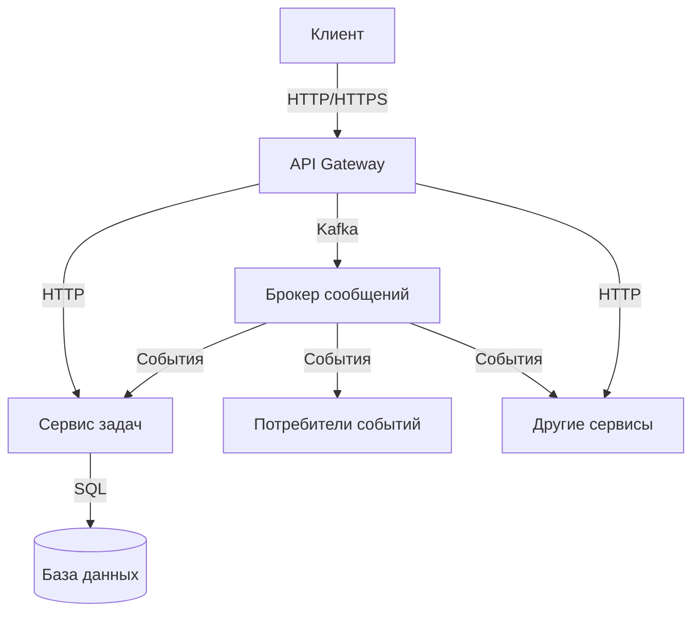
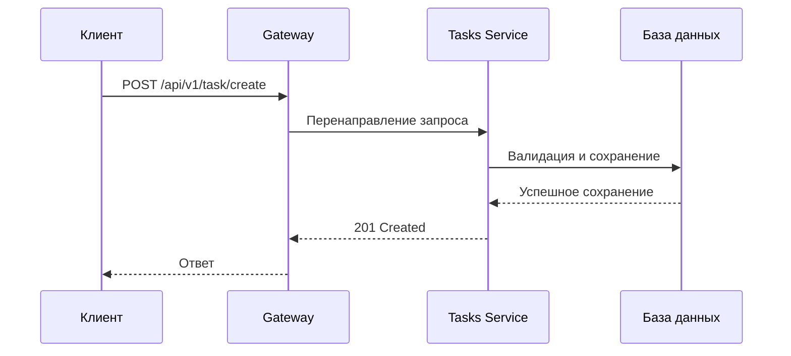
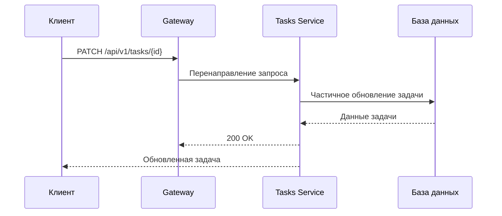
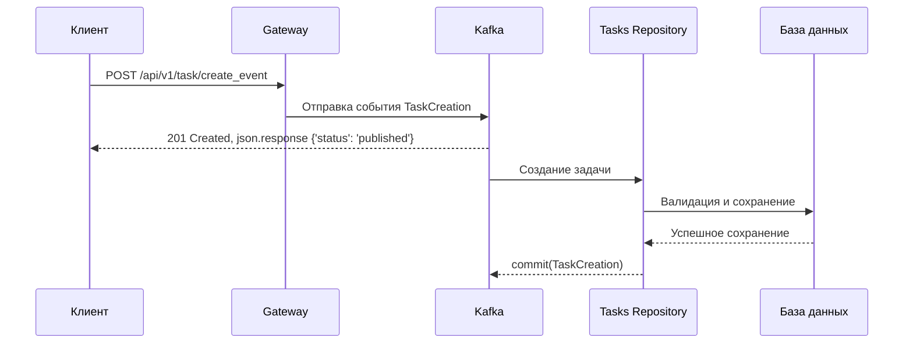

# Архитектура приложения

## Обзор

Приложение построено по микросервисной архитектуре с четким разделением ответственности между компонентами. Основные сервисы взаимодействуют через API и брокер сообщений (Kafka).

## Диаграмма компонентов

## Основные компоненты

### 1. API Gateway

- Единая точка входа для всех клиентских запросов
- Маршрутизация запросов к соответствующим сервисам

#### В дальнейшем планируется добавить:

- Аутентификация и авторизация
- Балансировка нагрузки
- Кеширование

### 2. Сервис задач (Tasks)

#### Основные функции:

- Управление задачами (CRUD операции)
- Валидация данных
- Бизнес-логика работы с задачами
- Интеграция с другими сервисами через события

### 3. База данных

- Хранение данных приложения

### 4. Брокер сообщений (Kafka)

- Асинхронная коммуникация между сервисами
- Обработка событий
- Обеспечение надежности доставки сообщений

### 1. Создание задачи

### 2. Обновление статуса задачи

### 3. Создание задачи через Kafka

